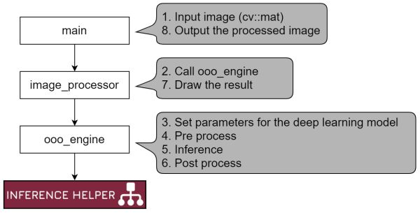

# Play with MNN
- Sample projects to use MNN in C++ for multi-platform
- Typical project structure is like the following diagram
    - 

## Target environment
- Platform
    - Linux (x64)
    - Linux (armv7)
    - Linux (aarch64)
    - Android (aarch64)
    - Windows (x64). Visual Studio 2019
- Option
    - with Vulkan
    - without Vulkan

## Usage
```
./main [input]

 - input = blank
    - use the default image file set in source code (main.cpp)
    - e.g. ./main
 - input = *.mp4, *.avi, *.webm
    - use video file
    - e.g. ./main test.mp4
 - input = *.jpg, *.png, *.bmp
    - use image file
    - e.g. ./main test.jpg
 - input = number (e.g. 0, 1, 2, ...)
    - use camera
    - e.g. ./main 0
```

## How to build a project
### 0. Requirements
- OpenCV 4.x
- Vulkan SDK (optional)

### 1. Download 
- Download source code and pre-built libraries
    ```sh
    git clone https://github.com/iwatake2222/play_with_mnn.git
    cd play_with_mnn
    git submodule update --init
    sh InferenceHelper/third_party/download_prebuilt_libraries.sh
    ```
- Download models
    ```sh
    sh ./download_resource.sh
    ```
- If you want to change pre-built library to be used, modify the following file
    - `InferenceHelper/third_party/cmakes/mnn.cmake`

### 2-a. Build in Linux
```
cd pj_mnn_cls_mobilenet_v2   # for example
mkdir -p build && cd build
cmake ..
make
./main
```

### 2-b. Build in Windows (Visual Studio)
- Configure and Generate a new project using cmake-gui for Visual Studio 2019 64-bit
    - `Where is the source code` : path-to-play_with_mnn/pj_mnn_cls_mobilenet_v2	(for example)
    - `Where to build the binaries` : path-to-build	(any)
- Open `main.sln`
- Set `main` project as a startup project, then build and run!

### 2-c. Build in Android project
If you want to run Android project, please open `ViewAndroid` directory in Android Studio.

You will need the following settings at first.

- Configure NDK
    - File -> Project Structure -> SDK Location -> Android NDK location
        - C:\Users\abc\AppData\Local\Android\Sdk\ndk\21.3.6528147
- Import OpenCV
    - Download and extract OpenCV android-sdk (https://github.com/opencv/opencv/releases )
    - File -> New -> Import Module
        - path-to-opencv\opencv-4.3.0-android-sdk\OpenCV-android-sdk\sdk
    - FIle -> Project Structure -> Dependencies -> app -> Declared Dependencies -> + -> Module Dependencies
        - select `sdk`
    - In case you cannot import OpenCV module, remove `sdk` module and dependency of `app` to `sdk` in Project Structure

# License
- Copyright 2020 iwatake2222
- Licensed under the Apache License, Version 2.0
    - [LICENSE](LICENSE)

# Acknowledgements
- This project utilizes OSS (Open Source Software)
    - [NOTICE.md](NOTICE.md)
